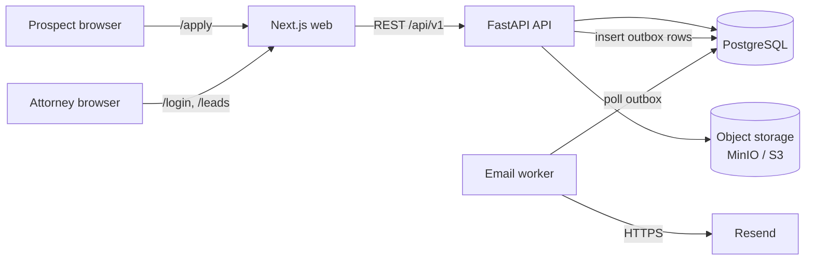
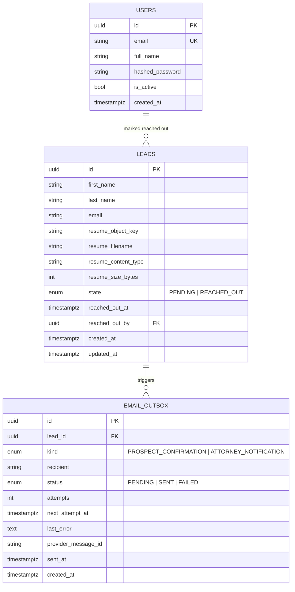

# Leads App — Design Document

## 1. Problem

Prospects fill in a **public** form (first name, last name, email, resume/CV). On submission the system:

1. Persists the lead and its resume.
2. Emails the prospect (confirmation) and an attorney (new-lead notification).
3. Exposes an **auth-guarded internal UI** where attorneys list leads, view details, download resumes, and move a lead from `PENDING` to `REACHED_OUT`.

Constraints from the brief: FastAPI for the API, Next.js for the web app, persistent storage, a real email service, production-style repo structure.

## 2. Assumptions

These are gaps in the brief that I filled with a decision. Each is cheap to change.

| Topic | Decision |
|---|---|
| Who gets the attorney email | A single configurable intake address (`ATTORNEY_NOTIFICATION_EMAIL`). Routing to a specific attorney or round-robin is a later feature. |
| Who can log in | Attorneys only. No public sign-up; accounts are created with a CLI command. All attorneys see all leads. |
| State machine | `PENDING → REACHED_OUT` only. The reverse transition is rejected. Recording *who* marked it and *when* is kept for audit. |
| Duplicate submissions | Allowed. The same email may apply more than once (e.g. with an updated CV); each submission is its own lead. |
| Resume formats | PDF, DOC, DOCX, max 10 MB. |
| Editing leads | Prospects cannot edit after submitting. "Updating leads" in the brief means attorneys updating state. |

## 3. Architecture



Five runtime pieces, all started by `docker compose up`:

| Service | Role |
|---|---|
| `web` | Next.js (App Router). Public form + internal dashboard. Acts as a backend-for-frontend: the browser only talks to this origin; the Next.js server holds the session cookie and calls the API. |
| `api` | FastAPI. All business logic, validation, auth, persistence. |
| `worker` | Same Python codebase, different entrypoint. Sends queued emails with retries. |
| `db` | PostgreSQL. Leads, users, email outbox. |
| `minio` | S3-compatible object storage for resumes (real S3 in production, same code). Pulled from quay.io, since MinIO no longer publishes to Docker Hub; those builds are frozen, which is acceptable for local development only. |

### Why this shape

- **FastAPI owns the domain; Next.js owns presentation.** No business rules or DB access in the web tier. The API is usable on its own (and documented at `/docs`), which is what "create, get, update leads" APIs imply.
- **Files in object storage, not the database.** Postgres stores only metadata and the object key. Resumes can be large and are write-once/read-rarely, which is exactly what S3 is for. MinIO locally means no cloud account is needed to run the project, and the S3 client code is identical in production.
- **Email via a transactional outbox, not inline.** See §6.

## 4. Data model



Indexes: `leads(state, created_at desc)` for the dashboard's default view, `leads(email)` for lookup, `email_outbox(status, next_attempt_at)` for the worker's poll.

Schema changes go through **Alembic** migrations, which run automatically when the API container starts.

## 5. API

Base path `/api/v1` (health check at the root). OpenAPI docs at `/docs`.

| Method | Path | Auth | Purpose |
|---|---|---|---|
| `POST` | `/leads` | Public | Create a lead. `multipart/form-data`: `first_name`, `last_name`, `email`, `resume`. Returns `201` with the lead id. |
| `GET` | `/leads` | Attorney | List leads. Query: `state`, `page`, `page_size`. Newest first. |
| `GET` | `/leads/{id}` | Attorney | Lead detail. |
| `PATCH` | `/leads/{id}` | Attorney | Update state. Body `{"state": "REACHED_OUT"}`. `409` if the transition is not allowed. |
| `GET` | `/leads/{id}/resume` | Attorney | Stream the resume file. |
| `POST` | `/auth/login` | Public | Email + password → access token. |
| `GET` | `/auth/me` | Attorney | Current user. |
| `GET` | `/healthz` | Public | Liveness/readiness (checks DB). |

Errors use one shape everywhere: `{"error": {"code": "...", "message": "...", "details": ...}}`.

### Lead creation flow

```mermaid
sequenceDiagram
    participant P as Prospect
    participant W as Next.js
    participant A as FastAPI
    participant S as Object storage
    participant D as Postgres
    participant K as Worker
    participant R as Resend

    P->>W: submit form
    W->>A: POST /leads (multipart)
    A->>A: validate fields, file type (magic bytes), size
    A->>S: put resume object
    A->>D: BEGIN; insert lead; insert 2 outbox rows; COMMIT
    A-->>W: 201 {id}
    W-->>P: "Thanks, we'll be in touch"
    loop every few seconds
        K->>D: claim due outbox rows (FOR UPDATE SKIP LOCKED)
        K->>R: send email
        K->>D: mark SENT / schedule retry
    end
```

If the DB write fails after the upload, the API deletes the uploaded object (best effort); a periodic sweep of orphaned objects is noted as future work.

## 6. Email: transactional outbox

Sending email synchronously inside the request (or with FastAPI `BackgroundTasks`) has two problems: if the provider is slow or down, either the prospect waits or the email is silently lost when the process restarts.

Instead, the lead and its two outbox rows are written **in the same transaction**. So a lead can never exist without its emails being queued, and a queued email can never exist without its lead. A separate `worker` process:

- claims due rows with `SELECT ... FOR UPDATE SKIP LOCKED` (safe to run several workers),
- sends through the provider,
- on failure, retries with exponential backoff up to a max attempts count, then marks `FAILED` and logs it for follow-up,
- passes an idempotency key (the outbox row id) to the provider so a crash between "sent" and "marked SENT" doesn't produce duplicate emails.

This uses Postgres as the queue, so there's no Redis/RabbitMQ to operate. At much higher volume this would move to a real queue (SQS etc.) with the same interface.

**Provider:** [Resend](https://resend.com), behind an `EmailSender` interface with two implementations:

- `ResendEmailSender` — real delivery, used when `RESEND_API_KEY` is set.
- `ConsoleEmailSender` — logs the rendered email; used in tests and when no key is configured, so the project still runs without an account.

Email bodies are Jinja2 templates (HTML + plain-text) in the API codebase.

> **Resend domain note:** until a sending domain is verified in Resend, the sandbox sender only delivers to the Resend account owner's own address. For a demo, set both the prospect email (in the form) and `ATTORNEY_NOTIFICATION_EMAIL` to that address, or verify a domain.

## 7. Authentication and authorization

- Attorneys are rows in `users` with **argon2**-hashed passwords, created via `python -m app.cli create-user`.
- `POST /auth/login` returns a short-lived signed **JWT** (HS256, 8h expiry).
- The browser never holds the token in JavaScript. Next.js's login server action stores it in an **httpOnly, Secure, SameSite=Lax cookie**. Server components and route handlers read the cookie and call the API with `Authorization: Bearer`.
- Next.js `proxy.ts` (Next 16's replacement for `middleware.ts`) redirects visitors without a session cookie away from internal routes to `/login`. The API independently checks the token on every internal endpoint; the proxy is UX, the API is the security boundary.
- If the API rejects a token (expired, user deactivated), the page redirects to `/api/auth/logout`, which clears the cookie and returns the user to `/login`.
- Resume downloads go through a Next.js route handler → API, so the file is only reachable with a valid session and storage is never exposed publicly.

Trade-off: JWTs can't be revoked before expiry. For a small internal user base with an 8h expiry that's acceptable; a server-side session table is the upgrade path.

## 8. Public endpoint hardening

The form is public, so it's the main abuse surface.

- **File validation:** extension allow-list plus magic-byte sniffing (a renamed `.exe` is rejected). The client's `Content-Type` is ignored; the stored type comes from our own allow-list.
- **Size limits while streaming:** an ASGI middleware counts request-body bytes as they arrive and aborts with `413` once past the limit, so an oversized upload is cut off rather than buffered. The exact 10 MB per-file limit is then checked on the parsed file. The Next.js route handler applies the same cap in front.
- **Stored under a generated key** (`leads/{lead_id}/{uuid}.{ext}`), never the user's filename, which is kept only as metadata and sanitized on download (`Content-Disposition`).
- **Rate limiting** per client IP on `POST /leads` and `POST /auth/login` (slowapi). The web tier forwards the visitor's IP in `X-Forwarded-For`, and uvicorn only trusts that header from addresses in `FORWARDED_ALLOW_IPS`. Limits are held in memory, which is correct for one API instance; with several replicas they'd move to Redis.
- **Honeypot field** in the form to drop naive bots without adding a CAPTCHA.
- **CORS** limited to the web origin.
- Input validation via Pydantic (email format, trimmed names, length limits).

## 9. Web app

Next.js App Router, TypeScript, Tailwind.

| Route | Access | Content |
|---|---|---|
| `/` | Public | Redirects to `/apply`. |
| `/apply` | Public | Lead form with client + server validation, file picker, success state. Submits to the `/api/leads` route handler, which forwards to the API. |
| `/login` | Public | Attorney login. |
| `/leads` | Attorney | Table: name, email, submitted, state badge. Filter by state, paginated. |
| `/leads/[id]` | Attorney | All fields, resume download, "Mark as reached out" button. |

Pages are server components that call the API directly, and mutations (login, logout, mark as reached out) are **server actions**, so the internal UI needs no client-side data-fetching library and never exposes the API token to browser JavaScript. Resume downloads go through the `/api/leads/[id]/resume` route handler, which streams the file from the API.

Timestamps are rendered in the viewer's own time zone by a small client component, since the server doesn't know it.

## 10. Repository layout

```
alma-leads-app/
├── README.md                 # how to run locally
├── docs/DESIGN.md            # this document
├── docker-compose.yml        # db, minio, api, worker, web
├── .env.example
├── .github/workflows/ci.yml  # lint, type-check, test (backend + frontend)
├── backend/
│   ├── pyproject.toml        # deps + ruff/mypy/pytest config (uv)
│   ├── Dockerfile
│   ├── alembic.ini
│   ├── alembic/versions/
│   ├── app/
│   │   ├── main.py           # app factory, middleware, routers
│   │   ├── cli.py            # create-user
│   │   ├── core/             # config (pydantic-settings), security, logging, errors
│   │   ├── db/               # engine, session, base
│   │   ├── models/           # SQLAlchemy models
│   │   ├── schemas/          # Pydantic request/response models
│   │   ├── repositories/     # DB queries, no business rules
│   │   ├── services/         # lead service, auth service
│   │   │   ├── email/        # EmailSender interface, Resend + console, templates
│   │   │   └── storage/      # ObjectStorage interface, S3 implementation
│   │   ├── api/
│   │   │   ├── deps.py       # current_user, db session, services
│   │   │   └── v1/           # auth.py, leads.py, health.py
│   │   └── worker/           # outbox poller entrypoint
│   └── tests/                # unit + API tests (pytest, httpx)
└── frontend/
    ├── package.json
    ├── Dockerfile
    └── src/
        ├── proxy.ts          # redirects signed-out visitors away from /leads
        ├── app/
        │   ├── apply/        # public form
        │   ├── login/        # sign-in page + server actions
        │   ├── (internal)/   # auth-guarded layout, leads list and detail
        │   └── api/          # route handlers: form submit, resume download, logout
        ├── components/
        └── lib/              # API client, session helpers, validation, types
```

Layering in the API is `routes → services → repositories/adapters`. Routes handle HTTP only, services hold business rules (validation, state transitions, outbox writes), and repositories and adapters (storage, email) are swappable. That's what keeps email and storage replaceable and the services unit-testable with fakes.

## 11. Testing and quality

- **Backend:** pytest against a real Postgres (compose service in CI), with fake storage and email adapters. Covers lead creation (valid, bad file, too large), auth, list/filter, state transitions (including the rejected ones), and the worker's retry logic.
- **Frontend:** ESLint, unit tests (Vitest) for the form validation, and a production build, which type-checks the app.
- **CI:** GitHub Actions runs ruff, mypy, pytest, `tsc`, ESLint, and the Next.js build on every push and PR.

## 12. Configuration

All config comes from environment variables (12-factor), validated at startup by pydantic-settings. The app refuses to start with a missing required value. See `.env.example` for the full list.

## 13. Not in scope (next steps)

- Assigning leads to specific attorneys, notes/activity log per lead.
- Virus scanning of uploads (e.g. ClamAV on upload, or S3 + scanning Lambda).
- Presigned download URLs instead of proxying, once files or traffic are large.
- Search across leads, CSV export.
- Revocable sessions, SSO for staff, audit log.
- Observability: structured logs are in; metrics/tracing (OpenTelemetry) would be next.
- Deployment config (e.g. container platform + managed Postgres + S3).
