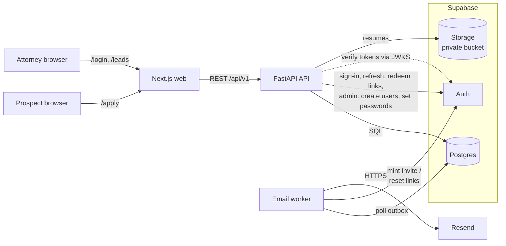
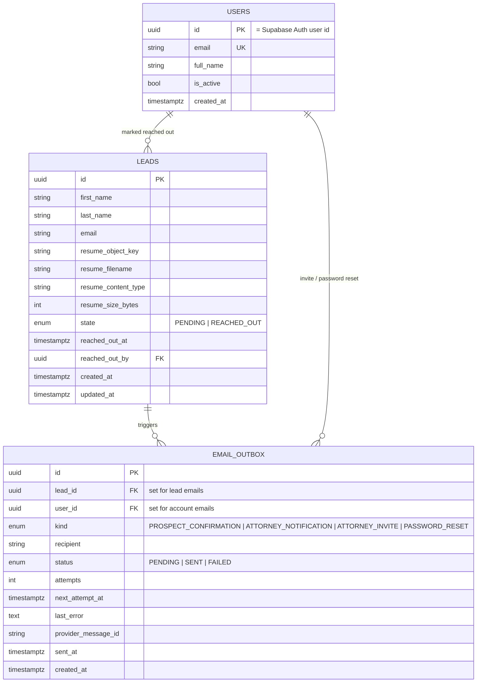

# Leads App — Design Document

## 1. Problem

Prospects fill in a **public** form (first name, last name, email, resume/CV). On submission the system:

1. Persists the lead and its resume.
2. Emails the prospect (confirmation) and an attorney (new-lead notification).
3. Exposes an **auth-guarded internal UI** where attorneys list leads, view details, read or download resumes, contact the prospect, and move a lead from `PENDING` to `REACHED_OUT`.

Constraints from the brief: FastAPI for the API, Next.js for the web app, persistent storage, a real email service, production-style repo structure. Platform choice: **Supabase** provides the database, authentication and file storage; **Resend** sends email.

## 2. Assumptions

These are gaps in the brief that I filled with a decision. Each is cheap to change.

| Topic | Decision |
|---|---|
| Who gets the attorney email | A single configurable intake address (`ATTORNEY_NOTIFICATION_EMAIL`). Routing to a specific attorney or round-robin is a later feature. |
| Who can log in | Attorneys only, and all attorneys see all leads. There is no public sign-up: the first account comes from a CLI command, and every later one from an email invite sent by a signed-in attorney (see §7). |
| State machine | `PENDING → REACHED_OUT` only. The reverse transition is rejected. Recording *who* marked it and *when* is kept for audit. |
| Duplicate submissions | Allowed. The same email may apply more than once (e.g. with an updated CV); each submission is its own lead. |
| Resume formats | PDF, DOC, DOCX, max 10 MB. |
| Editing leads | Prospects cannot edit after submitting. "Updating leads" in the brief means attorneys updating state. |

## 3. Architecture



| Piece | Role |
|---|---|
| `web` (Docker) | Next.js (App Router). Public form + internal dashboard. Acts as a backend-for-frontend: the browser only talks to this origin; the Next.js server holds the session cookies and calls the API. |
| `api` (Docker) | FastAPI. All business logic, validation and authorization; the only thing that talks to Supabase. |
| `worker` (Docker) | Same Python codebase, different entrypoint. Sends queued emails with retries; for invites and password resets it also asks Supabase Auth for the one-time link. |
| Supabase Postgres | Leads, attorney records, email outbox. Schema owned by Alembic migrations. |
| Supabase Auth | Attorney identities, passwords and sessions (access + refresh tokens). |
| Supabase Storage | Resume files, in the private `resumes` bucket. |

Locally, Supabase runs through the Supabase CLI (`supabase start`, configured by `supabase/config.toml`), and the app's containers reach it via `host.docker.internal`. Against a hosted Supabase project only `.env` changes.

### Why this shape

- **FastAPI owns the domain; Next.js owns presentation.** No business rules or DB access in the web tier. The API is usable on its own (and documented at `/docs`), which is what "create, get, update leads" APIs imply.
- **Supabase is infrastructure, not the API.** Supabase ships an auto-generated REST API over the database, but the brief asks for FastAPI APIs, and lead data shouldn't be one misconfigured policy away from the public. So only the backend talks to Supabase, with the secret key; the Data API is locked out of our tables (§7), and the browser never talks to Supabase directly.
- **Why Supabase:** one managed platform gives Postgres, a production-grade auth server (password hashing, refresh-token rotation, rate limits, admin API) and object storage, instead of hand-rolling auth and running a separate S3 service. The local CLI stack mirrors the hosted product, so moving to a hosted project is a config change.
- **Files outside the database, behind a storage interface.** Postgres stores only metadata and the object key. `ObjectStorage` has implementations for Supabase Storage (default), any S3 bucket, and local files, chosen by `STORAGE_BACKEND`.
  - *Why not MinIO locally?* It was the original plan, but MinIO stopped publishing community images (removed from Docker Hub in September 2026). Supabase Storage covers the same need.
- **Email via a transactional outbox, not inline.** See §6.

## 4. Data model



Indexes: `leads(state, created_at desc)` for the dashboard's default view, `leads(email)` for lookup, `email_outbox(status, next_attempt_at)` for the worker's poll, and `email_outbox(lead_id)` / `email_outbox(user_id)` for the foreign keys (the latter also backs the one-reset-email-per-minute check).

`users` holds only attorneys: Supabase Auth owns the identity and password, and a row here is what grants dashboard access. An invited attorney has a row from the moment they're invited, but no password (and so no way to sign in) until they accept. Each `email_outbox` row belongs to exactly one lead or one attorney (a check constraint enforces it). Resume files live in Supabase Storage; `resume_object_key` points at them.

Schema changes go through **Alembic** migrations, which run automatically when the API container starts. (Supabase's own `supabase/migrations` isn't used, so the same migrations run against plain Postgres in CI.)

## 5. API

Base path `/api/v1` (health check at the root). OpenAPI docs at `/docs`.

| Method | Path | Auth | Purpose |
|---|---|---|---|
| `POST` | `/leads` | Public | Create a lead. `multipart/form-data`: `first_name`, `last_name`, `email`, `resume`. Returns `201` with the lead id. |
| `GET` | `/leads` | Attorney | List leads. Query: `state`, `page`, `page_size`. Newest first. |
| `GET` | `/leads/{id}` | Attorney | Lead detail. |
| `PATCH` | `/leads/{id}` | Attorney | Update state. Body `{"state": "REACHED_OUT"}`. `409` if the transition is not allowed. |
| `GET` | `/leads/{id}/resume` | Attorney | Stream the resume file. `?disposition=inline` lets a PDF display in the browser; DOC/DOCX always download. |
| `GET` | `/leads/{id}/resume/preview` | Attorney | How to show the resume in the page: `pdf` (embed the file), `html` (a DOCX converted and sanitized), or `unavailable` (DOC). |
| `POST` | `/auth/login` | Public | Email + password → Supabase session (access + refresh token). Attorneys only. |
| `POST` | `/auth/refresh` | Public | Refresh token → new session (Supabase rotates the refresh token). |
| `POST` | `/auth/logout` | Attorney | Revoke the Supabase session. |
| `POST` | `/auth/invites` | Attorney | Invite an attorney by email, or re-send a pending invite (§7). `409` if they already have an account. |
| `POST` | `/auth/invites/accept` | Public | Invite token + password → sets the password and returns a session. |
| `POST` | `/auth/password-reset` | Public | Email a reset link. Same `202` answer whether or not the account exists. |
| `POST` | `/auth/password-reset/confirm` | Public | Reset token + new password → sets it, signs out other sessions, returns a session. |
| `GET` | `/auth/me` | Attorney | Current user. |
| `GET` | `/healthz` | Public | Liveness/readiness (checks DB). |

Errors use one shape everywhere: `{"error": {"code": "...", "message": "...", "details": ...}}`.

### Lead creation flow

```mermaid
sequenceDiagram
    participant P as Prospect
    participant W as Next.js
    participant A as FastAPI
    participant S as Object storage
    participant D as Postgres
    participant K as Worker
    participant R as Resend

    P->>W: submit form
    W->>A: POST /leads (multipart)
    A->>A: validate fields, file type (magic bytes), size
    A->>S: put resume object
    A->>D: BEGIN; insert lead; insert 2 outbox rows; COMMIT
    A-->>W: 201 {id}
    W-->>P: "Thanks, we'll be in touch"
    loop every few seconds
        K->>D: claim due outbox rows (FOR UPDATE SKIP LOCKED)
        K->>R: send email
        K->>D: mark SENT / schedule retry
    end
```

If the DB write fails after the upload, the API deletes the uploaded object (best effort); a periodic sweep of orphaned objects is noted as future work.

## 6. Email: transactional outbox

Sending email synchronously inside the request (or with FastAPI `BackgroundTasks`) has two problems: if the provider is slow or down, either the prospect waits or the email is silently lost when the process restarts.

Instead, the lead and its two outbox rows are written **in the same transaction**. So a lead can never exist without its emails being queued, and a queued email can never exist without its lead. A separate `worker` process:

- claims due rows with `SELECT ... FOR UPDATE SKIP LOCKED` (safe to run several workers),
- sends through the provider,
- on failure, retries with exponential backoff up to a max attempts count, then marks `FAILED` and logs it for follow-up,
- passes an idempotency key (the outbox row id) to the provider so a crash between "sent" and "marked SENT" doesn't produce duplicate emails.

This uses Postgres as the queue, so there's no Redis/RabbitMQ to operate. At much higher volume this would move to a real queue (SQS etc.) with the same interface.

**Provider:** [Resend](https://resend.com), behind an `EmailSender` interface with two implementations:

- `ResendEmailSender` — real delivery, used when `RESEND_API_KEY` is set.
- `ConsoleEmailSender` — logs the rendered email; used in tests and when no key is configured, so the project still runs without an account.

Email bodies are Jinja2 templates (HTML + plain-text) in the API codebase (`app/templates/email/`). The HTML versions share one layout and a few building blocks, styled like the web app; the rules for what mail clients can render are in [STYLE_GUIDE.md §7](STYLE_GUIDE.md#7-email). User input is auto-escaped.

**Account emails use the same outbox.** Attorney invites and password resets are queued the same way (`user_id` instead of `lead_id`), so they get the same retries, idempotency, templates and provider as lead emails, and Supabase never has to send mail itself (no second SMTP setup, and none of Supabase's built-in email rate limits). The row stores no secret: the worker asks Supabase for a fresh single-use link (`/admin/generate_link`) at the moment it sends. So a database dump or backup never contains a usable invite or reset link. A retry mints a new link, which replaces the previous one.

> **Resend domain note:** until a sending domain is verified in Resend, the sandbox sender only delivers to the Resend account owner's own address. For a demo, set both the prospect email (in the form) and `ATTORNEY_NOTIFICATION_EMAIL` to that address, or verify a domain.

## 7. Authentication and authorization

**Identity: Supabase Auth.** Passwords, hashing, sessions and refresh-token rotation are Supabase's job. The backend calls it over HTTP:

- `POST /auth/login` → Supabase password sign-in → the backend checks the user has an active row in `users`. A Supabase identity that isn't an attorney gets the same "invalid email or password" as a wrong password, and its session is revoked.
- `POST /auth/refresh` → Supabase refresh-token grant, with the same attorney check.
- Accounts are created with Supabase's **admin API** (secret key), then the `users` row is inserted. If that insert fails, the Supabase identity is deleted again, so the two never drift apart.

**Authorization: every API request.** `get_current_user` verifies the bearer token's signature against Supabase's **JWKS** (`/auth/v1/.well-known/jwks.json`, ES256; HS256 is accepted only if a legacy secret is configured), checks `exp` and `aud=authenticated`, then requires an active attorney row for `sub`. Signed-in but not an attorney → `403`.

**Accounts are invite-only**, because any account can read every lead's personal data and resume:

- There is **no sign-up page or endpoint**. Public self-sign-up is also **off in Supabase** (`[auth] enable_signup = false`), so nobody can create an identity by calling Supabase directly. Only the backend can, through the admin API. (The email provider itself stays on: `[auth.email] enable_signup = false` would disable password sign-in too.)
- The **first** attorney is created with `python -m app.cli create-user`, which needs shell access to the deployment. That is the trust anchor.
- After that, a signed-in attorney invites a colleague by name and email. The backend creates a Supabase user **without a password** plus the `users` row, and queues an invite email (§6). The link is per-person, single-use and expires after 24 hours (`otp_expiry`, the maximum Supabase allows, so invitees have a working day to act; reset links share the setting). Inviting someone whose invite is still pending sends a fresh link, which also invalidates the old one; inviting someone who has accepted is a `409`.
- **Accepting** (`/accept-invite?token=…`): the page shows a password form; only submitting it redeems the token (`/auth/v1/verify`), sets the password through the admin API and returns a session. The page load alone doesn't touch the token, so email link scanners that prefetch URLs can't burn it. The password length is checked *before* redeeming, since a redeemed token can't be reused.
- **Password reset** (`/forgot-password` → `/reset-password?token=…`): the request endpoint always answers `202` with the same message and only queues an email if the address belongs to an active attorney, so it can't be used to discover accounts. It's rate-limited per IP, and at most one reset email per account per minute is queued, so nobody can flood an attorney's inbox from many IPs. Confirming sets the new password and **signs out the account's other sessions**, in case the reset was prompted by someone else using it.
- Both token pages send `Referrer-Policy: no-referrer` and `noindex`, so the token in the URL isn't leaked to other sites or search engines.
- Login, accepting, and both reset endpoints are rate-limited per IP.
- Upgrade path: an admin role (today any attorney can invite), listing and revoking pending invites, and MFA.

**Keeping Supabase's Data API away from lead data.** Supabase exposes tables in `public` over REST/GraphQL to anyone with the publishable key, subject to row level security. Migration `0002` enables RLS on every table with no policies and revokes the `anon`/`authenticated` grants, and `config.toml` sets `auto_expose_new_tables = false`. The backend connects as the table owner, which RLS doesn't restrict. The resumes bucket is private, and only the backend's secret key can read it.

**Sessions in the browser.**

- The browser never holds a token in JavaScript. The login, accept-invite and reset-password server actions store the access and refresh tokens in **httpOnly, SameSite=Lax cookies** (Secure over HTTPS).
- Next.js `proxy.ts` runs before every internal page, server action and resume download. If the access token is missing or within a minute of expiring, it exchanges the refresh token through the API and hands the new cookies to both the current request and the browser. If that fails, it clears the cookies and redirects to `/login`.
- Signing out revokes the Supabase session and clears the cookies.
- The proxy is session plumbing; the API's token check is the security boundary.

Trade-off: an access token stays valid until it expires (1 hour by default) even after sign-out or deactivation. The attorney-row check on every request closes the deactivation case immediately; shortening `jwt_expiry` tightens the rest.

## 8. Public endpoint hardening

The form is public, so it's the main abuse surface.

- **File validation:** extension allow-list plus magic-byte sniffing (a renamed `.exe` is rejected). The client's `Content-Type` is ignored; the stored type comes from our own allow-list.
- **Size limits while streaming:** an ASGI middleware counts request-body bytes as they arrive and aborts with `413` once past the limit, so an oversized upload is cut off rather than buffered. The exact 10 MB per-file limit is then checked on the parsed file. The Next.js route handler applies the same cap in front.
- **Stored under a generated key** (`leads/{lead_id}/{uuid}.{ext}`), never the user's filename, which is kept only as metadata and sanitized on download (`Content-Disposition`).
- **Rate limiting** per client IP on `POST /leads`, login, accepting invites and both password-reset endpoints (slowapi). The web tier forwards the visitor's IP in `X-Forwarded-For`, and uvicorn only trusts that header from addresses in `FORWARDED_ALLOW_IPS`. Limits are held in memory, which is correct for one API instance; with several replicas they'd move to Redis.
- **Honeypot field** in the form to drop naive bots without adding a CAPTCHA.
- **CORS** limited to the web origin.
- Input validation via Pydantic (email format, trimmed names, length limits).

## 9. Web app

Next.js App Router, TypeScript, Tailwind. The look follows [STYLE_GUIDE.md](STYLE_GUIDE.md), based on tryalma.com: design tokens live in `globals.css`, and the Figtree font is self-hosted through `next/font`.

| Route | Access | Content |
|---|---|---|
| `/` | Public | Redirects to `/apply`. |
| `/apply` | Public | Lead form with client + server validation, file picker, success state. Submits to the `/api/leads` route handler, which forwards to the API. |
| `/login` | Public | Attorney login. |
| `/forgot-password` | Public | Request a password-reset email. |
| `/reset-password` | Public (token link) | Choose a new password, then land signed in. |
| `/accept-invite` | Public (token link) | Choose a password to finish an invite, then land signed in. |
| `/invite` | Attorney | Invite a colleague by name and email. |
| `/leads` | Attorney | Cards on phones, a table from tablet width: name, email, submitted, state. Clicking anywhere on a row opens the lead (the name stays the row's single link for keyboard and screen-reader users). Filter by state, paginated. |
| `/leads/[id]` | Attorney | Contact bar ("Email {name}" with a prefilled subject, "Copy email", "Mark as reached out"), all fields, and the resume shown in the page with a download button. |

Pages are server components that call the API directly, and mutations (login, logout, mark as reached out, invite, accept invite, request and confirm password reset) are **server actions**, so the internal UI needs no client-side data-fetching library and never exposes the API token to browser JavaScript. Resume downloads go through the `/api/leads/[id]/resume` route handler, which streams the file from the API.

**Viewing resumes in the page.** Uploaded files come from strangers, so the preview is deliberately narrow:

- **PDF:** embedded from `/api/leads/[id]/resume?disposition=inline` and shown by the browser's own PDF viewer. Only PDFs are ever served `inline`, always with their allow-listed content type and `nosniff`. That one route may be framed by our own pages (`X-Frame-Options: SAMEORIGIN`, `frame-ancestors 'self'`); everything else stays `DENY`. Phones get an "Open" button instead, since mobile browsers render embedded PDFs poorly.
- **DOCX:** converted server-side with mammoth, embedded images skipped, and the output passed through an nh3 allow-list (text formatting, lists, tables, and `http`/`https`/`mailto` links only). Archives that would expand past 50 MB are refused before anything is decompressed. The HTML is rendered in an iframe with an empty `sandbox`, so even a sanitizer gap couldn't run script or reach the app.
- **DOC:** legacy binary Word needs LibreOffice to read, which would add hundreds of MB to the image and a heavyweight parser to the attack surface. These show a download button only; converting them is a possible next step.

Timestamps are rendered in the viewer's own time zone by a small client component, since the server doesn't know it.

## 10. Repository layout

```
alma-leads-app/
├── README.md                 # how to run locally
├── docs/
│   ├── DESIGN.md             # this document
│   └── STYLE_GUIDE.md        # visual design: tokens, type, components, email
├── docker-compose.yml        # api, worker, web (Supabase runs via its CLI)
├── supabase/config.toml      # local Supabase stack: auth settings, resumes bucket
├── .env.example
├── .github/workflows/ci.yml  # lint, type-check, test (backend + frontend)
├── backend/
│   ├── pyproject.toml        # deps + ruff/mypy/pytest config (uv)
│   ├── uv.lock               # pinned dependency versions
│   ├── Dockerfile
│   ├── alembic.ini
│   ├── alembic/versions/
│   ├── app/
│   │   ├── main.py           # app factory, middleware, routers
│   │   ├── cli.py            # create-user (the first attorney)
│   │   ├── core/             # config (pydantic-settings), security, logging, errors
│   │   ├── db/               # engine, session, base
│   │   ├── models/           # SQLAlchemy models
│   │   ├── schemas/          # Pydantic request/response models
│   │   ├── repositories/     # DB queries, no business rules
│   │   ├── services/         # leads, auth (invites, resets), Supabase Auth client,
│   │   │   │                 #   resume validation and preview (DOCX → sanitized HTML)
│   │   │   ├── email/        # EmailSender interface, Resend + console, rendering
│   │   │   └── storage/      # ObjectStorage: Supabase Storage, S3, local files
│   │   ├── templates/email/  # shared layout + one HTML and text template per email
│   │   ├── api/
│   │   │   ├── deps.py       # current_user, db session, services
│   │   │   └── v1/           # auth.py, leads.py, health.py
│   │   └── worker/           # outbox poller entrypoint
│   └── tests/                # unit + API tests (pytest, httpx)
└── frontend/
    ├── package.json
    ├── package-lock.json     # pinned dependency versions
    ├── Dockerfile
    └── src/
        ├── proxy.ts          # refreshes sessions; redirects signed-out visitors to /login
        ├── app/
        │   ├── globals.css   # design tokens (see STYLE_GUIDE.md)
        │   ├── apply/        # public form
        │   ├── login/        # sign-in page + server actions
        │   ├── (account)/    # forgot/reset password, accept invite + server actions
        │   ├── (internal)/   # auth-guarded layout, leads list and detail, invite
        │   └── api/          # route handlers: form submit, resume stream, logout
        ├── components/       # forms, resume viewer, badges, shared page parts
        └── lib/              # API client, session helpers, validation, types
```

Layering in the API is `routes → services → repositories/adapters`. Routes handle HTTP only, services hold business rules (validation, state transitions, outbox writes), and repositories and adapters (storage, email) are swappable. That's what keeps email and storage replaceable and the services unit-testable with fakes.

## 11. Testing and quality

- **Backend:** pytest against a real Postgres (a service container in CI). Supabase Auth is replaced by an in-memory fake that issues real signed tokens, so the verification path is exercised; the Supabase Auth and Storage HTTP clients are tested against mocked responses, and ES256/JWKS verification with a generated key. Also covers lead creation (valid, bad file, too large), the invite and password-reset flows end to end (queue → worker → link → set password), resume previews (DOCX conversion, script and `javascript:` link stripping, zip bombs, corrupt files, PDF-only inline serving), list/filter, state transitions (including the rejected ones), and the worker's retry logic. Emails are checked for escaping of user input.
- **Frontend:** ESLint, unit tests (Vitest) for form and password validation and token-expiry handling, and a production build, which type-checks the app.
- **CI:** GitHub Actions runs ruff, mypy and pytest for the backend, and ESLint, Vitest and the Next.js build (which runs the TypeScript check) for the frontend, on every push and PR. Both sides install from lock files (`uv.lock`, `package-lock.json`), so CI and local runs use the same versions.

## 12. Configuration

All config comes from environment variables (12-factor), validated at startup by pydantic-settings. The app refuses to start with a missing required value. See `.env.example` for the full list.

## 13. Not in scope (next steps)

- Assigning leads to specific attorneys, notes/activity log per lead.
- Virus scanning of uploads (e.g. ClamAV on upload, or S3 + scanning Lambda).
- Presigned download URLs instead of proxying, once files or traffic are large.
- Search across leads, CSV export.
- SSO for staff (Supabase Auth supports it), audit log.
- Observability: structured logs are in; metrics/tracing (OpenTelemetry) would be next.
- Deployment config (e.g. container platform for web/api/worker + a hosted Supabase project), with a verified Resend sending domain so confirmations reach every prospect.
- Previews for legacy `.doc` resumes (a LibreOffice conversion service), and a periodic sweep of orphaned resume objects.
- MFA for attorneys (Supabase Auth's TOTP factors, enforced by requiring `aal2` tokens in the API), and an admin role for inviting.
